# ASIX2_Gestor de Contraseñas_GTX <br> Desarrolladores: Xavi Conde, Tim Kalugin, Gerard Soteras

## 💡  Explicación de la idea del proyecto
<details>
  <summary>Explicación 🔽</summary>
 
 En este proyecto nos vamos a centrar en crear una aplicación web que funcione como un gestor de contraseñas. La idea es que esta web permita a los usuarios crear una cuenta y añadir aplicaciones, webs, usuarios y contraseñas de forma fácil e intuitiva, pero siempre con seguridad. 
 
 Nos enfocaremos principalmente en el back-end, pero también intentaremos que el front-end esté bien diseñado para que sea accesible para cualquier usuario. Nuestro gestor podrá almacenar todas las contraseñas de forma cifrada, y estarán gestionadas por una llave maestra (masterkey).
  
  La seguridad que vamos a implementar como desarrolladores incluye: contraseñas cifradas, una base de datos segura, y una masterkey con un cifrado más robusto.
  Para los usuarios, la seguridad se basará en dos cosas: su contraseña de usuario y la masterkey. Así, los usuarios podrán gestionar todas sus cuentas y contraseñas de manera centralizada, segura y sencilla.
</details>

## 🎯  Objetivo que se persigue
<details>
  <summary>Explicación 🔽</summary>

Hemos mantenido con solidez nuestros objetivos iniciales, ya que todos los integrantes perseguíamos los mismos objetivos y las motivaciones eran muy parecidas.
Desde que decidimos crear un gestor de contraseñas en forma de aplicación web, queríamos que las contraseñas de esta se almacenaran y transportaran de manera cifrada, además todas las contraseñas serían gestionadas por una contraseña maestra. Esta contraseña maestra enlazará la Base de Datos con la aplicación web.
   
Además, de cara al usuario, queremos facilitar la vida a los usuarios para que empleen el tiempo mínimo en buscar, añadir o manejar sus datos personales de autenticación.
Además, garantizamos que sus datos estarán protegidos en nuestro gestor.
   
Y de manera personal buscaremos trabajar con herramientas, aplicaciones, lenguajes y servicios nuevos para nosotros para conseguir alcanzar nuevos conocimientos y conceptos que consideramos que nos serán útiles en nuestra carrera profesional.
   
*Con todo esto hemos realizado la siguiente estructura, donde resume los objetivos que buscaremos cumplir.*

- **1 (Objetivo General)** - Gestionar contraseñas de manera sencilla y segura
- - **1.1 (Objetivo Específico)** - Programar un gestor de contraseñas  
- - - **1.1.1 (Objetivo Operativo)** - Aplicar los conceptos aprendidos  
- - **1.2 (Objetivo Específico)** - Potenciar la sencillez y la seguridad  
- - - **1.2.1 (Objetivo Operativo)** - Desarrollar un front-end intuitivo  
- - - **1.2.2 (Objetivo Operativo)** - Desarrollar un back-end seguro  

- **2 (Objetivo General)** - Aumentar nuestros conocimientos  
- - **2.1 (Objetivo Específico)** - Alcanzar ámbitos y conceptos nuevos  
- - - **2.1.1 (Objetivo Operativo)** - Hacer un trabajo personal extraescolar, para adquirir nuevos conocimientos teóricos  
- - - **2.1.2 (Objetivo Operativo)** - Proponernos retos grupales, para mantener una buena línea de aprendizaje

</details>

## 📝  Organización y roles del equipo
<details>
  <summary>Organización 🔽</summary>
  Al ser un grupo que en el primer año del grado ya trabajamos juntos en varios proyectos, la organización resultó sencilla.
  
  Hemos decidido que todos haremos de todo, pero cada uno tendrá un rol de “líder” en cada apartado en el que hemos distribuido el proyecto, este líder será el encargado únicamente de marcar el ritmo y de comunicar al resto del grupo cómo vamos en relación con los objetivos y fechas acordados al inicio.
  
  Al final de cada clase se pondrá en común el trabajo de cada integrante, con el objetivo de que todas las personas en todo momento sepan que se ha hecho ese día y si algún día hay una baja, que se pueda seguir trabajando con normalidad.
  
  En el aspecto de las tareas, todos haremos todas las tareas, sin excepción.
</details>

<details>
  <summary>Roles 🔽</summary>  
  
  - Xavi - Front-end, Programación, Proxmox, escritos (GitHub)
  - Gerard - Back-end cifrado, Redes, escritos (GitHub)
  - Tim - Back-end BBDD, Proxmox, gestores de tareas y escritos (GitHub)
</details>

> [!IMPORTANT]
> Los líderes informan del tiempo, no quiere decir que trabajen más en esas áreas que otro compañero.

## 💻  Tecnologías a utilizar (lenguajes, framework, sistemas, software...)
<details>
  <summary>Front-end 🔽</summary>

  - HTML
  - CSS
  - Bootstrap
  - Colores a utilizar en el front-end: #234C17 y #B5FFA6
</details>

<details>
  <summary>Back-end 🔽</summary>

   - JavaScript
   - Node.JS
</details>

<details>
  <summary>Base de Datos 🔽</summary>
  
  - Google Firebase
</details>

<details>
  <summary>Cifrado 🔽</summary>
  
  En nuestro proyecto hemos elegido estas opciones de cifrado:
  - PBKDF2 + salt 
  - AES-GCM + uso de vector de inicialización.
  - AES-256
  - Hexadecimal
</details>

<details>
  <summary>Certificados 🔽</summary>
  
  - OpenSSL -> TLS (de manera interna). 
  - Cloudflare SSL (de manera externa).
</details>

<details>
  <summary>Software 🔽</summary>
  
  - Visual Studio
  - Trello
  - GitHub
  - Cloudflare
  - Pi-hole
  - Nginx
</details>

## 🔨  Arquitectura del sistema
<details>
  <summary>Explicación 🔽</summary>
  Usaremos la arquitectura cliente-servidor de tres capas, la haremos en capas para así poder trabajar cada capa por separado y hacerlo de manera más sencilla y efectiva, para poder cumplir con los plazos de entrega.
  
  Las tres capas se dividirán:
  - Cliente: Esta parte interactuará con el usuario, es decir, la mayoría del front-end estará en esta capa.
  - Servidor: Manejará la parte lógica y la base de datos y se encargará del procesamiento de solicitudes. También se gestionará el cifrado y las contraseñas
  - BBDD: Aquí se almacenarán los datos persistentes, como las contraseñas cifradas y las cuentas de usuario.
</details>

<details>
  <summary>Tabla de arquitectura de los sistemas 🔽</summary>
  
  | Máquina       | S.O                  | Almacenamiento / Memoria| Servicio     | 
  |---------------|----------------------|-------------------------|--------------|
  | **Proxmox**   |Proxmox-VE 8.2        | 93Gb / 8Gb              |  Hypervisor  |
  | **Router**    |Ubuntu server 22.04.2 | 14Gb / 4Gb              |  DHCP        |
  | **FireBase**  |Ubuntu server 22.04.2 | 14Gb / 4Gb              |Base de datos |
  | **Pi-Hole**   |Debian 12.7.0         | 14Gb / 512Mb            |      DNS     |
  | **NGinx**     |Ubuntu server 22.04.2 | 14Gb / 4Gb              |    Hosting   |
</details>

<hr>

# Estilo web
Para garantizar una experiencia de usuario intuitiva y coherente, hemos trabajado en un diseño visual lo más simple posible, aplicando principios de accesibilidad y claridad. Nos hemos centrado en lograr una estética y una estructura que se mantengan alineadas con el objetivo del proyecto y las necesidades del usuario final.

## 🧩  MockUp
<details>
  <summary>Explicación 🔽</summary>
  Como se muestra en el mockup, nuestra web será sencilla. Cuando entremos a la web por primera vez, nos encontraremos con un panel sencillo que nos dará dos opciones, "Iniciar sesión" y "Registrarse".<br>
  Cada opción nos mandará a la página correspondiente, cuyo diseño será parecido al ya visto, con la diferencia que los títulos referenciarán dónde nos encontramos.
  
  En la página de registro aparecerá un pequeño formulario que nos solicitará correo electrónico, contraseña para entrar, nombre de usuario y llave maestra. Además, habrá un botón que permitirá ir a la página de iniciar sesión si ya tienes una cuenta registrada.
  
  En la página de iniciar sesión nos mostrará los espacios correspondientes para introducir el usuario y la contraseña previamente registrada en la web. También estará disponible la opción de "¿Has olvidado tu contraseña?", "¿No tienes cuenta? Regístrate ya", la casilla para activar si quieres recordar el dispositivo y un ojo que mostrará la contraseña, ya que cuando se escribe no se muestra.
  
  Una vez iniciada la sesión, el diseño de la web será simple. Se mostrarán las aplicaciones que hemos guardado en el gestor, con un botón que agregará una aplicación en la parte superior.
  
  A la hora de registrar una aplicación, se pedirá el nombre de la aplicación, la URL del sitio web de la aplicación, el usuario y si se quiere generar una contraseña o introducir una personal. También habrá un espacio para poner comentarios. Una vez configurado, se usará un botón con "Guardar" para finalizar la acción de agregar una aplicación.  
  
  Una vez tengamos algunas aplicaciones registradas, pulsando el botón "Ver detalles", aparecerá una ventana donde se deberá introducir la llave maestra. En caso de introducirla correctamente, se mostrará la información previamente introducida para la aplicación correspondiente y tres botones: "Editar", "Volver" y "Eliminar". Si la llave maestra es errónea, se redirige al usuario a la página principal de la web.
</details>

<details>
  <summary>Imagen del Mockup 🔽</summary>
  
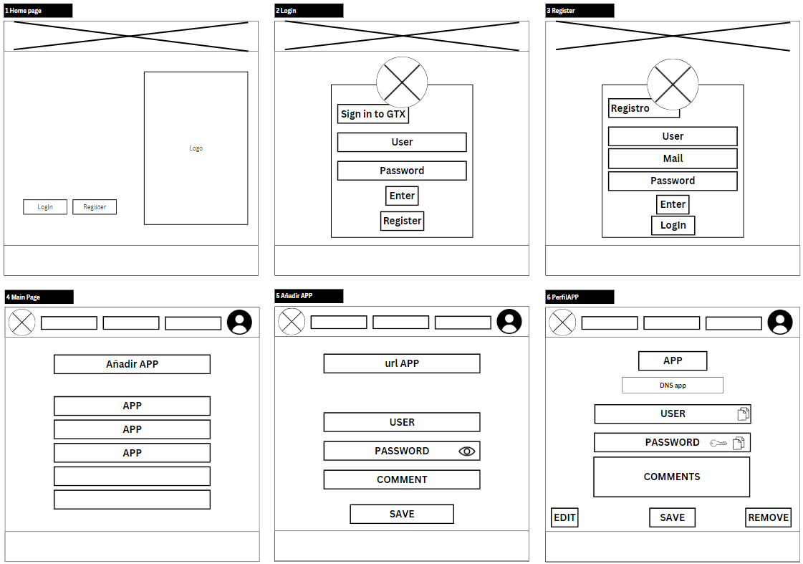
</details>

## 🌲  Árbol Web
<details>
  <summary>Explicación 🔽</summary>
  Como se puede ver en la imagen del árbol web, hemos optado por crear una página sencilla e intuitiva para el usuario. Para mejorar la experiencia, hemos diseñado la navegación de forma que el usuario necesite hacer el menor número de clics posible para acceder a todas las funcionalidades de nuestra web.
</details>

<details>
  <summary>Imagen del árbol web 🔽</summary>
  
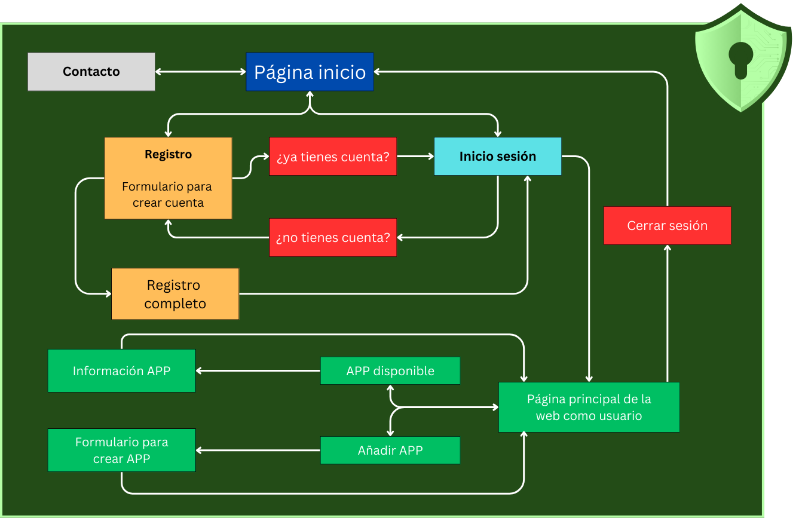
</details>

## 🎨  Gama cromática
<details>
  <summary>Explicación 🔽</summary>
  Hemos optado por una paleta de colores en tonos verdes, que van desde un verde oscuro (#234C17) a un verde más claro (#B5FFA6). Estos colores están pensados para transmitir una sensación de seguridad, estabilidad y confianza, características fundamentales en un gestor de contraseñas. 
  El verde también está asociado con zonas seguras y aprobadas, lo que refuerza la idea de que los usuarios estarán en un entorno protegido para almacenar su información sensible. Además, los colores blanco (#FFFFFF) y negro (#000000) se usan como base para asegurar legibilidad y simplicidad, sin distraer la atención de la funcionalidad principal de la plataforma.
</details>

<details>
  <summary>Imagen de la gama cromática 🔽</summary>
  

</details>

## 🛡️  Logotipo
<details>
  <summary>Explicación 🔽</summary>
  El logotipo elegido es un escudo verde con una cerradura en el centro, lo que simboliza la protección de las contraseñas, que actúan como llaves para acceder a las diferentes cuentas de los usuarios. 
  
  El escudo representa seguridad, confiabilidad y defensa, lo que refuerza el objetivo del gestor de contraseñas: proporcionar un entorno seguro para almacenar y gestionar de manera centralizada los datos de autenticación. 
  El detalle del circuito en el fondo del escudo agrega un toque tecnológico, conectando el concepto de ciberseguridad con el propósito del proyecto.
</details>

<details>
  <summary>Imagen del logotipo 🔽</summary>
  

</details>

<hr>

# 🚀 PROXMOX
Proxmox Virtual Environment (Proxmox VE) es un entorno de virtualización de servidores de código abierto. Es una distribución de GNU/Linux basada en Debian, con una versión modificada del Kernel Ubuntu LTS​ y permite desplegar y gestionar máquinas virtuales y contenedores LXC.

Para la creación de nuestro proyecto, vamos a usar Proxmox. Utilizaremos uno de los ordenadores disponibles en el aula para montar nuestro servidor PROXMOX, con el que trabajaremos para crear todos los servicios que necesitamos.

## 🟠  Entorno ProxMox
<details>
  <summary>Explicación 🔽</summary>
  Dentro de Proxmox, configuraremos una red NAT para que todas las máquinas virtuales que creemos tengan conexión entre ellas.
  Como elementos principales, tendremos tres Ubuntu Servers. Uno de ellos funcionará como router virtual y proporcionará DHCP El otro nos proporcionara el hosting usando Nginx y un tercero nos proporcionará un hosting de respaldo. 
  Estos tres servidores acompañados de una maquina virtual que trabajará como cliente y un contenedor LXC que nos proporcionará el servicio DNS utilizando Pi-Hole.
    
  Para crear la red NAT con la que se comunicarán las máquinas dentro de Proxmox, añadiremos un "Linux Bridge" y lo configuraremos para crear la red interna, a la que llamaremos vmbr1. Por defecto, la red externa (en nuestro caso la del aula) se llama vmbr0.
  
  El proceso que seguimos fue el siguiente: primero, instalamos y configuramos la máquina router. Al añadir la máquina, le asignamos la nueva interfaz de red que creamos anteriormente en el apartado de hardware. Una vez configurado el router, duplicamos la máquina para crear el equipo cliente, y modificamos el netplan para que tenga su propia dirección IP dentro de la red interna. En los anexos dejamos el primer borrador de la arquitectura de red que hicimos.
  
  ### Configuración de QEMU
  Instalaremos en la máquina cliente y en el router el paquete qemu-guest-agent. Gracias a esto, podremos administrar las máquinas virtuales de una manera más fácil.
  Una vez instalado en las máquinas, es necesario configurar las máquinas virtuales que nos ofrece Proxmox.
</details>

> 📎 [**Ver _anexo 1_ para entorno ProxMox**](#anexo-1-entorno-proxmox)

## 🕸️  Arquitectura de Red
<details>
  <summary>Explicación 🔽</summary>
  Para nuestro proyecto, hemos configurado una red virtual utilizando Proxmox, en la cual hemos desplegado todos los servicios esenciales para nuestro gestor de contraseñas. En la imagen se observa la división entre el 'Entorno Aula' y el 'Entorno Proxmox'.
  En el Entorno Aula (100.77.20.0/24), contamos con acceso a internet y dispositivos físicos que se comunican con el router, mientras que en el Entorno Proxmox (10.20.30.0/24), hemos creado una red privada donde residen los servidores y servicios internos, proporcionando un entorno controlado para nuestro sistema.
  
  Cada dispositivo en Proxmox cumple un rol específico:
  - Router: conecta ambas redes, actúa como gateway y distribuye direcciones IP mediante DHCP en la red de Proxmox.
  - Pi-hole (10.20.30.2): configurado como servidor DNS, filtra y redirige las solicitudes DNS dentro de la red interna.
  - Nginx (10.20.30.20): ofrece el servicio web (Nginx), primeramente accesible desde la red del aula mediante una regla en IPTables. 
  - Firebase: proporciona los servicios de base de datos y hosting necesarios para el funcionamiento del gestor de contraseñas.
  
  En la imagen, los dispositivos que ofrecen servicios se encuentran subrayados en verde, mientras que aquellos que consumen servicios están subrayados en rojo.
  También se ha indicado si las IPs son estáticas para facilitar la configuración y el acceso a cada servicio. De esta forma, el diseño asegura que cada dispositivo esté claramente identificado y cumpla su función en la red interna de Proxmox.
</details>

<details>
  <summary>Imagen de arquitectura de red final 🔽</summary>
  
  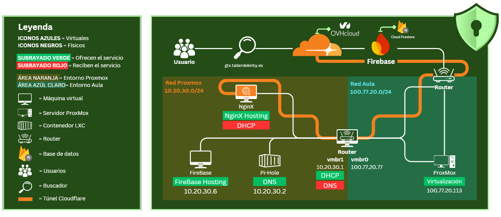
</details>

<details>
  <summary>Tabla de arquitectura de red final 🔽</summary>
  
  | Máquinas         | IP                                         | IP Gateway                          | Red                           |
  |------------------|--------------------------------------------|-------------------------------------|-------------------------------|
  | Proxmox          | 100.77.20.113                              | 100.77.20.1                         | 100.77.20.0/24                |
  | VM Ubuntu Router | 100.77.20.77 (externa)<br>10.20.30.1 (interna) | 100.77.20.1 (externa)<br>10.20.30.1 (interna) | vmbr0 (100.77.20.0/24)<br>vmbr1 (10.20.30.0/24) |
  | Nginx            | DHCP (fija por MAC a la IP 10.20.30.20)    | 10.20.30.1                          | vmbr1 (10.20.30.0/24)         | 
  | Pihole           | 10.20.30.5                                 | 10.20.30.1                          | vmbr1 (10.20.30.0/24)         |
  | FireBase         | 10.20.30.6                                 | 10.20.30.1                          | vmbr1 (10.20.30.0/24)         |
  | VM Ubuntu Cliente| DHCP                                       | 10.20.30.1                          | vmbr1 (10.20.30.0/24)         |

</details>

> [!IMPORTANT]
> Las funciones del cliente y Nginx se verán modificadas por la futura integración de Cloudflare en el proyecto. Más adelante veremos como afecta.

## 🛠️  Configuración de ROUTER
<details>
  <summary>Explicación 🔽</summary>
  Primero configuramos la red del router. Para ello cambiaremos el netplan ajustando las IP según la red, virtual o aula. Con ens18 identificaremos la red del aula y con ens19 la red virtual.
  Además, hemos implementado el servicio de DHCP en el router para que todos los dispositivos que estén dentro de la red virtual puedan obtener una IP sin necesidad de asignarla manualmente.
  
  ### Configuración de DHCP
  Para configurar el servicio DHCP, primero lo instalaremos en el router con el comando correspondiente. Luego crearemos una copia de seguridad del archivo de configuración para conservar la configuración original. Procederemos a editar el archivo de configuración y, en nuestro caso, hemos asignado el rango de IPs de *10.20.30.20* a *10.20.30.50*.
  
  También configuraremos la IP *10.20.30.20* para que siempre se asigne a la máquina, haciendo uso de su MAC, que contiene el servicio de Nginx. Esto nos permitirá abrir el puerto 80 con IPTables y dirigirlo hacia esta dirección IP, logrando que podamos acceder a nuestra página de Nginx desde los ordenadores del aula. Además, modificaremos el archivo ```isc-dhcp-server``` para indicar al router que funcione como servidor DHCP en la interfaz ens19.

```
# comandos usados

sudo apt install isc-dhcp-server                        # instalación del servicio
sudo cp /etc/dhcp/dhcpd.conf /etc/dhcp/dhcpd.conf.BKP   # creación de la copia de archivo
sudo nano /etc/dhcp/dhcpd.conf                          # modificación del archivo de configuración
sudo nano /etc/default/isc-dhcp-server                  # modificación del archivo de asiganción de interfaz
```
  
  ### Configuración de IPTables
  Para permitir que el cliente tenga acceso a la red exterior, debemos instalar y configurar IPTables en el router para habilitar el redireccionamiento del tráfico. Para ello, modificaremos el archivo ```/etc/sysctl.conf```. Dentro de este archivo, descomentaremos una línea que permitirá reenviar el tráfico entre las diferentes interfaces de red hacia el router que tenemos en Proxmox.
  
  También añadiremos una regla para permitir el tránsito por el puerto 80 y de este modo poder acceder al servicio de Nginx desde un ordenador del aula.
  En el archivo de configuración verificaremos si hay alguna regla habilitada en IPTables y añadiremos una nueva para realizar el enmascaramiento NAT en el tráfico saliente de la interfaz de red ens18. Configuraremos una regla que permita que el tráfico de la red interna fluya hacia la red externa. Por último, añadiremos una regla adicional para que las solicitudes desde la red interna puedan regresar, logrando así una comunicación bidireccional.
  
  Una vez finalizadas las configuraciones de IPTables, guardaremos dichas reglas con el comando adecuado. Para que las reglas de IPTables se mantengan después de reiniciar el sistema, instalaremos el paquete *iptables-persistent*.

```
# comandos usados para la configuración principal de IPtables

sudo iptables -t nat -A POSTROUTING -o ens18 -j MASQUERADE                                 # regla de enmascaramiento NAT en el tráfico saliente
sudo iptables -A FORWARD -i ens18 -o ens19 -j ACCEPT                                       # regla para permitir el tráfico de la red interna hacia la externa
sudo sysctl -p                                                                             # aplicación de las nuevas reglas
sudo iptables -A FORWARD -i ens19 -o ens18 -m state --state ESTABLISHED,RELATED -j ACCEPT  # regla para permitir el tráfico de retorno
sudo iptables-save                                                                         # guardar reglas de IPtables
```

  Para permitir que los ordenadores del aula puedan conectarse a nuestro servicio de Nginx en el puerto 80 (IP externa: 100.77.20.77:80), hemos añadido una nueva regla en IPTables para redirigir el tráfico al servidor Nginx especificando su dirección IP.

```
# comando usado para añadir regla de reenvio de puerto 80

sudo iptables -t nat -A PREROUTING -i ens18 -p tcp --dport 80 -j DNAT --to-destination 10.20.30.20:80
```
</details>

> 📎 [**Ver _anexo 2_ para configuración del Router**](#anexo-2-configuración-del-router)
>
> 🚩 [Ver informe de errores](#errores-con-el-router)

## 🛠️  Configuración de CLIENTE
<details>
  <summary>Explicación 🔽</summary>
  Configuramos la red del cliente, cambiando el netplan para usar la interfaz ens19, con una IP dentro de la red. Como aún no hemos configurado ningún servicio DHCP, asignaremos la IP estática 10.20.30.5.
  Una vez tengamos el servicio DHCP configurado, modificaremos nuevamente el netplan para conseguir que la interfaz obtenga una IP dinámica.
  
  ### Comprobación de conexión entre máquinas
  Una vez configurado el netplan tanto en el router como en el cliente, realizamos un ping entre ambas máquinas para comprobar que hay conexión dentro de la red virtual que hemos creado.
  Tras verificar el correcto funcionamiento de la red, haremos un ping desde el router y el cliente hacia la red exterior, como por ejemplo a "google.com". Si obtenemos conexión, podremos concluir que tanto el router como el cliente están bien configurados.
</details>

> 📎[**Ver _anexo 3_ para configuración del Cliente**](#anexo-3-configuración-del-cliente)

## 🛠️  Configuración de Servidor DNS
<details>
  <summary>Explicación 🔽</summary>
  
  Para crear un servidor DNS dentro de nuestra red interna, hemos decidido usar la herramient Pi-Hole y ejecutarla dentro de un contenedor LXC ya que nunca habiamos usado Pi-Hole ni contendores y asi hemos podido hacer una primera toma de contacto con ambos.
  Despues de crear el contenedor de Proxmox con el hardware especificado en la tabla "Arquitectura del sistema" usamos el comando que te indican en la pagina oficial de Pi-Hole.
  
```
git clone --depth 1 https://github.com/pi-hole/pi-hole.git Pi-hole
cd "Pi-hole/automated install/"
sudo bash basic-install.sh
```
  Lo tenemos que hacer con "git clone" ya que en el propio contenedor el comando "curl" no lo reconoce. 
  Una vez hecho esto trabajaremos todo el servidor DNS dentro del archivo ```/etc/resolv.conf```.
  Pondremos todas las lineas de ese archivo, comentadas.
  Añadiremos la línea "nameserver 127.0.0.1" para que el mismo contenedor de Pi-Hole sea su propio servidor DNS.
</details>

> 📎 [**Ver _anexo 4_ para configuración Pi-hole**](#anexo-4-configuración-pi-hole)
> 
> 🚩 [Ver informe de errores](#errores-pi-hole-dns-server)

## 🛠️  Configuración de Firebase
<details>
  <summary>Explicación 🔽</summary>
  
  ### Firestore
  Para nuestro proyecto, en lugar de usar una base de datos relacional como MySQL, optaremos por una base de datos no relacional gracias a Firestore. Ya que es un tipo de base de datos que hasta ahora no hemos visto y además en un entorno totalmente nuevo para nuestro desarrollo. Además, es un sistema que trabaja en tiempo real y almacena los datos en la nube, esto encaja a la perfección para nuestro proyecto.

  Después de una investigación sobre el funcionamiento de las BBDD NO relacionales, nuestra primera propuesta para la Base de Datos es la que mostraremos a continuación, pero no descartamos cambios futuros.
  Los datos obtenidos de los usuarios se almacenará de la siguiente manera:

```
USUARIOS (Colección)
├── id_usuario (Documento)
│   ├── email: ""                (Correo electrónico del usuario)
│   ├── masterkey: ""            (Clave maestra utilizada para el cifrado)
│   ├── nombre: ""               (Nombre del usuario)
│   ├── salt: ""                 (Salt para reforzar la seguridad del cifrado)
│   └── APP (Colección)
│       ├── id_app (Documento)
│       │   ├── appContra: ""    (Contraseña de la aplicación, cifrada)
│       │   ├── appName: ""      (Nombre de la aplicación)
│       │   ├── appUrl: ""       (URL de la aplicación)
│       │   ├── appUser: ""      (Nombre de usuario en la aplicación)
│       │   ├── comment: ""      (Comentario opcional sobre la aplicación)
│       │   └── iv: ""           (Vector de inicialización para el cifrado)
│       └── ...
└── id_usuario_2
    └── ...
```

La instalación paso a paso nos la facilita el propio firebse, en la siguiente guía: https://firebase.google.com/docs/database/web/start?hl=es-419.

Durante la configuración de Firebase, abriremos el puerto 2220 para poder hacer la conexión *ssh máquina física* - *máquina firebase*.
Instalamos firebase en la máquina virtual con ```sudo npm install -g firebase-tools``` y nos logeamos usando ```firebase login```, para empezara trabajar dentro de nuestro Firebase.

A partir de aqui tenemos la opción de trabajar por comandos o en su interfaz gráfica que encontramos en la web. Nosotros hemos decidio crear la base de datos de manera gráfica.

Firebase tiene la opción de modificar un elemento al que llama **reglas**, estas nos permiten controlar el acceso a la base de datos y el almacenamiento. Para que no nos devuelva un error de conexión *archivos de la página web* *firebase hosting*, hemos tenido que modificar las reglas y permitir que los usuarios puedan modificar la base de datos.
Destacar, que una vez que toda la conexión este en funcionamiento, esta regla será modificada para garantizar la seguridad de la propia base de datos.

<details>
 <summary>Reglas Firestore 🔽</summary>
 
 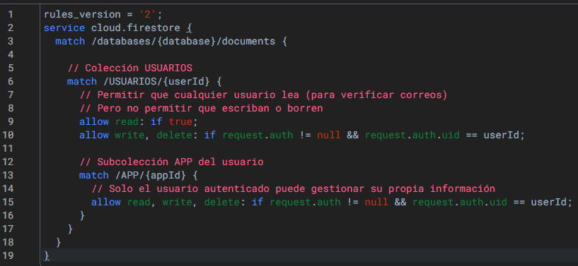
</details>

### Firebase hosting
Hemos decidido hostear la página web en Firebase, ya que al tener la BD alojada en esa misma plataforma, evitaremos problemas futuros de vinculación o compatibilidad.
La principal información que tenemos para iniciar el hosteo de la página web es crear un archivo ```.js``` para añadir un script con las credenciales de nuestro Firebase, aunque nosotros hemos tenido que aplicar algunos cambios a este, para garantizar el correcto funcionamiento del hosting.
</details>


> 📎 [**Ver _anexo 5_ para configuración de Firebase**](#anexo-5-configuración-firebase)
> 
> 🚩 [Ver informe de errores](#errores-con-firebase)

## 🛠️  Configuración de Nginx
<details>
  <summary>Explicación 🔽</summary>
  NGINX es un servidor web open source de alta performance que ofrece el contenido estático de un sitio web de forma rápida y fácil de configurar.
  
  Para nuestro proyecto, el uso del servicio Nginx no es estrictamente necesario, pero realizaremos una instalación sencilla para demostrar cómo se llevaría a cabo su configuración. 
  Como ya hemos creado una regla en el router que permite el acceso a la web desde los ordenadores del aula, nos resultará más fácil comprobar que la configuración de Nginx se realiza correctamente.
  
  Primero, configuramos el archivo ```gtx.com.conf``` en el directorio de configuración de Nginx, ubicado en ```/etc/nginx/sites-available/```.
  Dentro de ```gtx.com.conf```, especificamos que el servidor escuche en el puerto 80 y definimos el nombre del servidor como *gtx.com*. 
  
  Además, configuramos rutas específicas para almacenar los logs de errores y de acceso, facilitando así un mejor seguimiento de las solicitudes HTTP atendidas por Nginx. 
  Indicamos también el directorio raíz donde se almacenarán los archivos de la página web y definimos el archivo de inicio (index.html, ya que no usamos index.php en este proyecto). 
  No incluimos *index.php* porque nuestra base de datos es *NoSQL*, y no requerimos PHP en el sitio web.
  
  Para habilitar el sitio, creamos un enlace simbólico desde *sites-available* a *sites-enabled*.

```
# copiamos el archivo default preinstalado en un nuevo archivo llamado gtx.com.conf
sudo cp /etc/nginx/sites-available/default /etc/nginx/sites-available/gtx.com.conf

# enlace simbólico desde sites-available a sites-enabled
sudo ln -s /etc/nginx/sites-available/gtx.com.conf /etc/nginx/sites-enabled/
````

  ### Crear el Directorio del Sitio Web
  Creamos un nuevo directorio dentro de ```/var/www/``` para almacenar todos los archivos de la página web y luego clonamos el repositorio de la web desde Git en este directorio, permitiendo así que podamos visualizar la página web desde los equipos del aula al acceder a la IP pública del router (100.77.20.77) en el puerto 80.

```
# creación del direcctorio
sudo mkdir -p /var/www/gtx.com

# clonación de repositiorio de la web en el nuevo directorio
git clone <URL_DEL_REPOSITORIO> /var/www/gtx.com
```

  ### Actualización DNS en Pi-Hole
  Para facilitar el acceso a la página web en la red interna de Proxmox, añadimos un registro DNS en Pi-Hole para que gestorgtx.com resuelva a la IP interna del servidor Nginx (10.20.30.20). Esta configuración se realizó desde la interfaz gráfica de Pi-Hole. 
  Ahora, al buscar gestorgtx.com en la red interna de Proxmox, los dispositivos obtienen la dirección interna y pueden acceder directamente a la página web alojada en Nginx.
</details>

> 🚩 [Ver informe de errores](#errores-con-nginx)

<hr>

#  ☁️ CloudFlare
Cloudflare es una empresa que ofrece servicios muy potentes de seguridad y optimización de páginas webs. Se beneficia de su CDN que acelera la carga de las páginas, mientras que su tecnología de protección contra ataques DDoS y amenazas cibernéticas asegura la estabilidad y seguridad de los sitios. Además, optimiza el tráfico web para mejorar la experiencia del usuario y reducir la carga en los servidores.
 
 Nosotros hemos querido aventurarnos a trabajar nuestros DNS públicos en Cloudflare para conocer su funcionamiento y aprovecharnos de su potencial. I los DNS internos con certificado ```https``` los hemos conseguido con OpenSSL.
 
 Gracias a Alina, docente de nuestro centro, que nos proporcionó un dominio para trabajar sobre él pudimos explorar esta opción sin necesidad de gastar dinero.

<details>
  <summary>Configuración CloudFlare 🔽</summary>
 
 ## Configuración CloudFlare
 Como la configuración de los DNS internos de Cloudflare con el dominio de Alina ya estaban cambiados y hay un manual en internet que indica de manera sencilla y rápida cómo hacerlo, vamos a ir directamente a la creación y configuración del túnel.
 Aprovechamos la opción de crear túneles, para crear un túnel que evadiera todos los routers que existen hasta llegar a nuestro equipo que esta hosteando la página web (Funcionamiento parecido a una VPN), así conseguimos mantener la seguridad de la red al no ser necesario abrir puertos extras en ninguna máquina ni en el router.
 Para la configuración de estos túneles debemos acceder al apartado CloudFlare > Zero Trust > Networks > Tunnels > Add a Tunel.
 Para la configuración del túnel veremos una pantalla como la de la imagen de abajo, en ella debemos poner el subdominio que queremos usar de manera pública, además del servicio por el cual queremos que se vea la página web, y seguido debemos indicar la IP de la máquina que hostea la página web.
 
 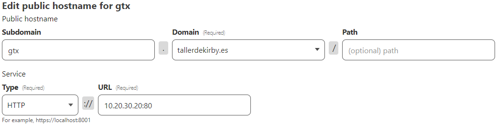
 En nuestro caso lo estamos haciendo en un contenedor de nginx.
 
 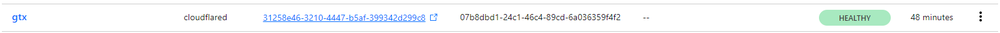
Una vez creado el túnel, el recuadro que nos sale en verde en esta captura, nos saldrá en gris. Para que la conexión se establezca correctamente debemos añadir las líneas de comando del anexo, en la máquina que hostea la página web. (Lo veremos en el siguiente apartado)
</details>

<details>
  <summary>Configuración Nginx 🔽</summary>

 ## Configuración Nginx
 
 Una vez hemos conseguido que la página web se muestre al público con el protocolo ```https```, vamos a conseguir que este protocolo trabaje también en la red virtual de proxmox.
 Esto lo haremos con la biblioteca OpenSSL, que nos permite crear certificados de protocolos seguros en páginas webs dentro de nuestra red interna, cabe destacar que los certificados que se generan con OpenSSL solo tienen validez en redes internas y con una duración limitada, ya que existe el certificado, pero no existe ningún sello que lo valide para salir a la red pública como ```https```.

 Para trabajar cómodamente, nosotros hemos creado un directorio ```mkdir /etc/nginx/ssl```, este lo usaremos para guardar el certificado y su clave privada.
 Seguido de esto modificaremos el archivo de configuración principal ```/etc/nginx/nginx.conf``` y añadiremos un script (facilitado por Cloudflare) dentro del apartado ```http``` que veremos en el anexo. Este script lo que hará es gestionar el certificado, la clave, la escucha... Para garantizarnos una correcta conexión por el puerto:443 para garantizarnos el ```https``` de manera interna.
 De esta manera conseguiremos un cifrado de extremo a extremo en la página web, tanto de manera privada como pública.
</details>

<details>
  <summary>Configuración Certificado OpenSSL 🔽</summary>

   ### OpenSSL
 
 OpenSSL es una biblioteca de criptografía que ofrece una aplicación de código abierto del protocolo TLS, esto nos permite gestionar certificados ```https``` y crear claves públicas para poder utilizar estos certificados.
 En nuestro caso la aplicación de este ha sido dentro de la máquina nginx, ya que es la que nos está hosteando la página web en la que queremos aplicar el protocolo TLS
 Después de haber creado el directorio ```/etc/nginx/ssl```, trabajaremos dentro de este. 
 Empezamos con la instalación:
 ```bash
 sudo apt update && sudo apt upgrade #actualizamos los paquetes
 sudo apt install openssl #instalamos la biblioteca
 openssl version #confirmamos que la instalacion se ha realizado correctamente 
 ```
 Vamos a generar el certificado y la clave:
 ```bash
openssl genrsa -out server.key 2048                #generamos la clave "server" lo podemos cambiar por el nombre que nosotros queremos
openssl req -new -key server.key -out server.csr   #generamos el certificado "server" lo podemos cambiar por el nombre que nosotros queremos
openssl x509 -req -days 365 -in server.csr -signkey server.key -out server.crt  #Para autofirmar el certificado, con una validez de 365 dias
 ```
Después de esto, tendremos que rellenar un formulario como el siguiente

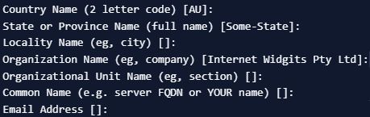

Una vez rellenado ya tendremos todo configurado y nuestra página web corriendo en ```https```
</details>

> 📎 [**Ver _anexo 6_ para configuración de CloudFlare**](#anexo-6-configuración-cloudflare)
> 
> 🚩 [Ver informe de errores](#errores-con-configuración-de-cloudflare)
 
<hr>

# 📎 Anexos
## Anexo 1 (entorno ProxMox)
<details>
  <summary>Ver anexo 🔽</summary>
  
  ### Adaptador puente
  Asignamos al router que use un adaptador puente para que pueda comunicar el interior de la red, con el exterior. Esto lo hacemos configurando el vmbr0 con la red externa y añadiendo un nuevo adaptador vmbr1 con la IP de la red virtual.
  
  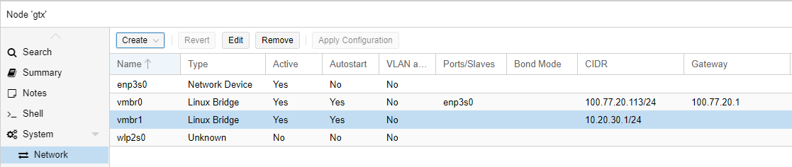
  ### Interfaz de red para el router
  Aquí podemos ver que una vez realizadas las acciones de la imagen anterior, el router ya nos reconocerá como hardware, las dos interfaces de red.
  
  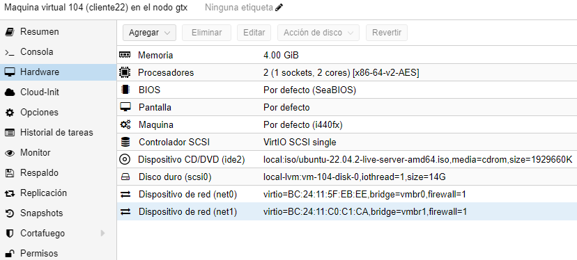
  ### Borrador de arquitectura de red inicial
  Esta es la arquitectura de red que usamos inicialmente para guiarnos durante la configuración de todo nuestro entorno, la usamos como base y una vez creada y configurada, le fuimos añadiendo servicios y equipos para mejorar la seguridad y el funcionamiento.
  
  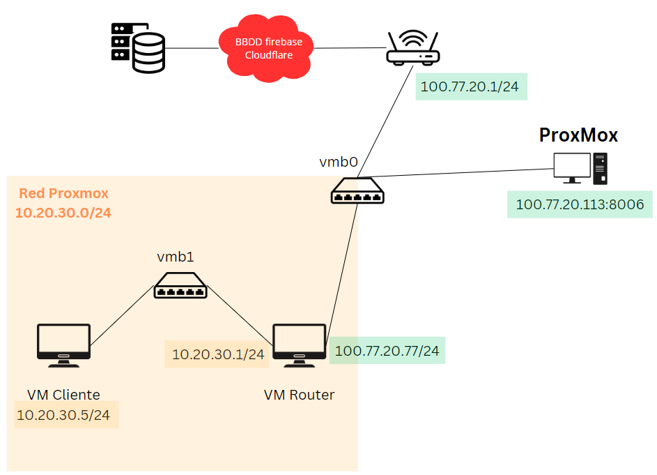
  ### Panel de configuración para activar QEMU
  Activamos y configuramos la función QEMU, para que nos sea mucho más fácil trabajar con las IP's existentes sin necesidad de acceder a la máquina.
  
  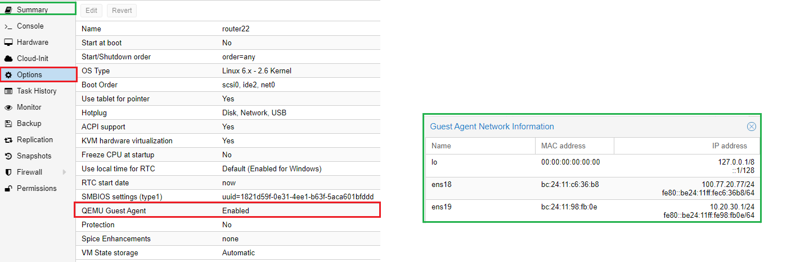
</details>

## Anexo 2 (configuración del Router)
<details>
  <summary>Ver anexo 🔽</summary>
  
  ### Netplan del router
  Esta configuración es extremadamente importante para que el router garantice la total comunicación entre la red interna y la externa, en la primera parte vemos la configuración para la red 100.77.20.0/24 (externa) y en la segunda parte 10.20.30.0/24 (virtual).
  
  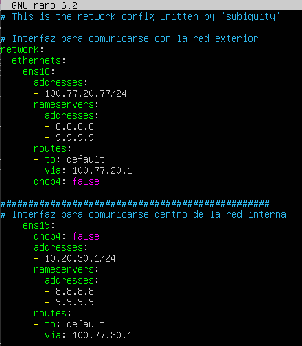
  ### Archivo sysctl
  Configuramos el router para que pueda hacer de gateway y pueda enrutar el tráfico de red para garantizar la comunicación en las redes presentes en el archivo "netplan".
  
  
  ### Archivo de configuración DHCP en el router
  Añadimos y modificamos las lineas necesarias en para que el router haga de DHCP en la red 10.20.30.0/24. Para garantizar la seguridad y la redundancia de IP's dentro de esta red, además configuramos una línea para que empiece a asignar IP's a partir de la 10.20.30.20, para poder añadir contenedores, equipos y servidores sin que afecten a la asignacion de IP's.
  
  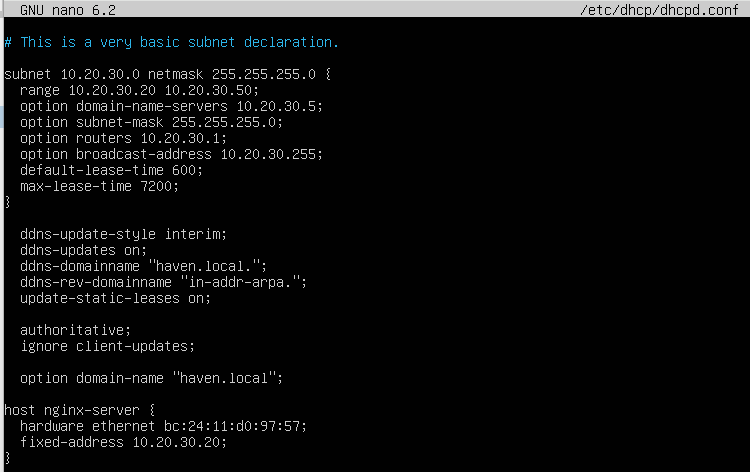
  ### Archivo de configuración ISC-DHCP en el router
  Con estas líneas le pedimos al router que asigne direcciones IP solo en la interfaz ens19 para IPv4, usando las rutas de configuración y PID predeterminadas. No está configurado para IPv6.

  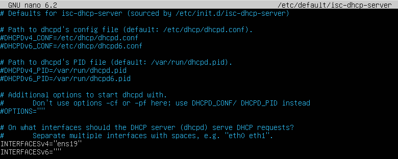
  ### Configuración IPtables
  PREROUTING: Redirige el tráfico entrante en el puerto 80 (HTTP) de la interfaz ens18 hacia la IP interna 10.20.30.20:80.
  
  POSTROUTING: Aplica MASQUERADE en la interfaz ens18, permitiendo que las direcciones IP privadas salgan a Internet usando la IP pública de la interfaz.
  
  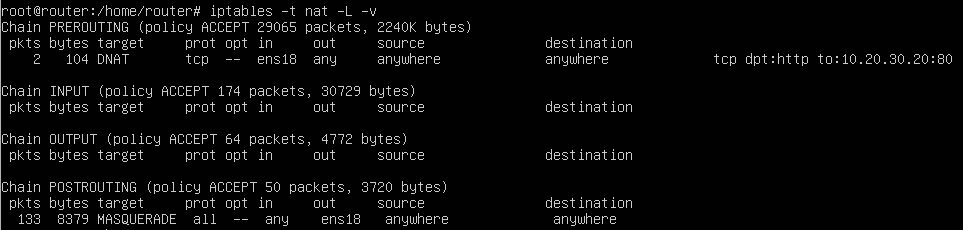
  ### Instalación IPtablesPersistent
  Permitimos que las IPTables sean persistentes. Para que no se borren ni se sobreescriban.
  
  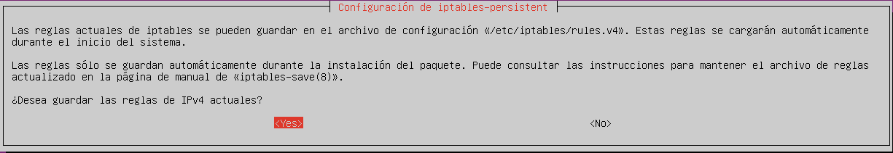
</details>

## Anexo 3 (configuración del Cliente)
<details>
  <summary>Ver anexo 🔽</summary>
  
  ### Netplan inicial del cliente con IP estática
  Usaremos esta configuración si queremos configurar el cliente antes del DHCP del router, para poder trabajar siempre con la misma IP sin que busque un DHCP.
  
  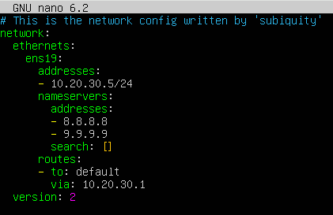
  ### Netplan final del cliente con IP dinámica
  Una vez tengamos el DCHP del router bien configurado, dejaremos el netplan del cliente con estas escasas líneas, para que la IP siempre sea asignada por el servidor de DHCP en este caso, el router.
  
  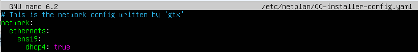
  
  ## Comprobación de conexión entre máquinas
  ### Conexión entre máquinas
  Realizamos un ping entre el router y la máquina cliente, para asegurarnos de que todas las configuraciones están funcionando sin problema.
  
  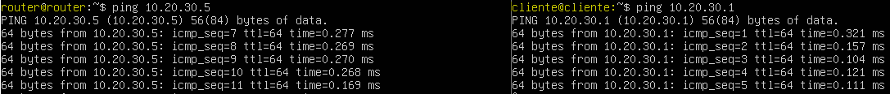
  ### Conexión hacia red exterior con IP estática
  Y hacemos un ping hasta una IP que exista en la red interna, para ver si el router enruta correctamente los paquetes y comunica ambas redes.
  
  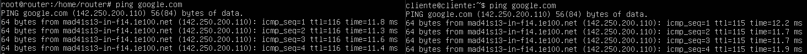
  ### Conexión hacia red exterior con IP dinámica y comprobación de conexión hacia la red exterior.
  Aquí mostramos que todo funciona correctamente, viendo que la IP es asignada por el router y que sale el tráfico al exterior.
  
  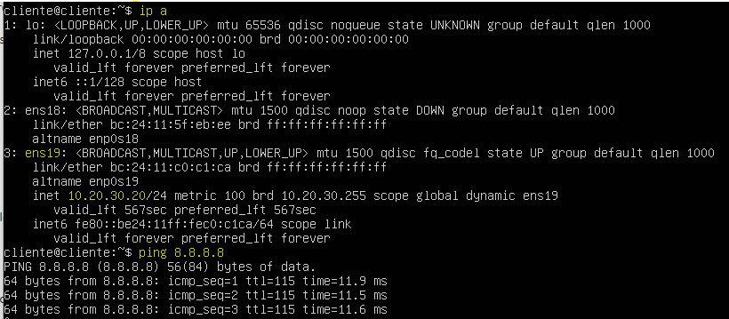
</details>

## Anexo 4 (configuración Pi-hole)
<details>
  <summary>Ver anexo 🔽</summary>
  
  ### Archivo de resolución DNS
  La única línea no comentada, que debe existir en el archivo ```/etc/resolv.conf```, debe ser la siguiente, para que el servidor se haga de DNS al mismo usando 127.0.0.1.
  
  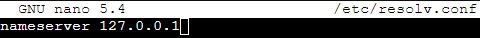
  ### Archivo de automatización de arranque persistente
  El archivo anterior, se actualiza automáticamente por culpa de la configuración predeterminada [(ver Informe de errores > Errores Pi-Hole DNS server)](#errores-pi-hole-dns-server) del *contenedor* y del mismo *proxmox*, haciendo así que la única manera de solucionarlo sea modificando directamente el archivo ```/tmp/crontab.7mqIpj/crontab```.
  
  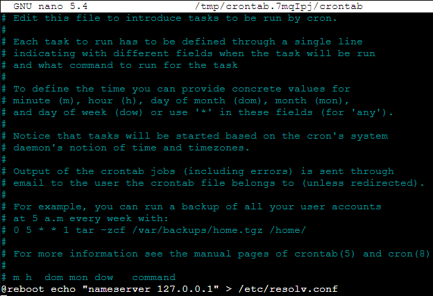
</details>

## Anexo 5 (configuración Firebase)
<details>
  <summary>Ver anexo 🔽</summary>

  ### Script vinculador
  Asignamos nuestras claves y la información necesaria en este script de JS, que te facilita el mismo Firebase. Para generar una conexión entre la página web y el servicio de firestore database.
  
  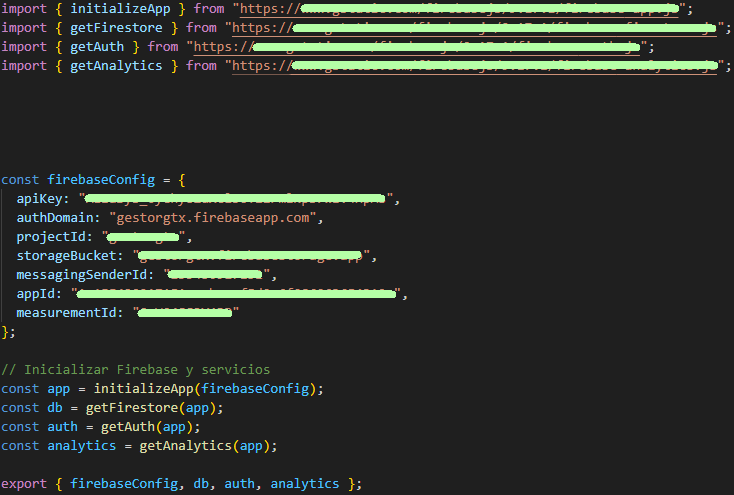

  ### Distribución base de datos
  Aquí vemos de manera gráfica toda la distribución de los datos en la base de datos, tanto las Colecciones, Documentos y Campos.
  
   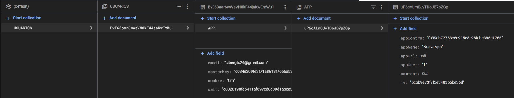
</details>

## Anexo 6 (configuración CloudFlare)
<details>
  <summary>Ver anexo 🔽</summary>

  ### Comandos de configuración Cloudflare
  Si no tenemos Cloudflare instalado:
  ```
  curl -L --output cloudflared.deb https://github.com/cloudflare/cloudflared/releases/latest/download/cloudflared-linux-amd64.deb
  sudo dpkg -i cloudflared.deb
  sudo cloudflared service install eyJhIjoiYjdhYTllNjc0YjQwNDdhNDhlYTFhYjEyOWE5ZDVjZTUiLCJ0IjoiZDljZmNiOWQtYTBlZS00NWMwLTkwOTAtY2U5MTEzNTM2MWI2IiwicyI6Ik1XTTBZek5rTW1FdFlqWmpaUzAwTW1NMkxUaGpZbVV0WmpnMlpXTm1OVGxsWXpVMCJ9
  ```
  Si tenemos Cloudflare instalado:
  ```
  sudo cloudflared service install eyJhIjoiYjdhYTllNjc0YjQwNDdhNDhlYTFhYjEyOWE5ZDVjZTUiLCJ0IjoiMjFkZDI1NmUtMDU1OC00YzZiLWIwYzktODUwNzQ3MzdhMDlhIiwicyI6Ik9XRmtORFEyWmpFdE5UUTFOaTAwTURrM0xUa3dZamd0TmpFeVpXTmpOV0ptWW1JMiJ9
  ```

 Dentro de ```/etc/nginx/nginx.conf``` debemos añadir las siguientes líneas, dentro del apartado de ```http```:
 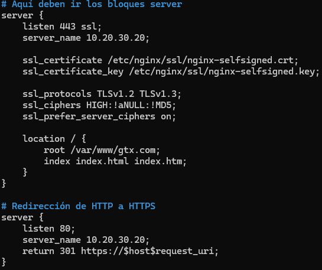
</details>

<hr>

# 🚩 Informe de errores
En este apartado se encuantran todas las dificultades y errores que han ido surgiendo a medida que progresava el proyecto.

## Errores con el router
<details>
  <summary>Ver informe 🔽</summary>
A la hora de configurar el router, tuvimos sobre todo problemas con errores tipográficos. Esto sucedió tanto en la configuración de Netplan como en la configuración de las reglas de IPtables.
Además, tuvimos varios problemas al intentar guardar las reglas de IPtables, ya que, al reiniciar el router, algunas reglas desaparecían. Esto ocurría porque las reglas no se guardaban de modo persistente.
</details>
  
## Errores Pi-hole DNS Server
<details>
  <summary>Ver informe 🔽</summary>
  
  En la version de **Proxmox 8.2.2**, el archivo ```/etc/resolv.conf``` se sobrescribe automáticamente dos veces al reiniciar el contenedor debido a:

  **1a vez:** *Servicio systemd-resolved:* Modifica el archivo de configuración DNS, de manera automática.

  **2a vez:** *Proxmox:* Sobrescribe el archivo durante el inicio del contenedor.

  Esto provoca que:
    **No** podemos modificar manualmente el archivo /etc/resolv.conf.
    **No** se pueden ejecutar scripts que cambien el archivo en el arranque del contenedor.
    **No** se puede filtrar el tráfico DNS adecuadamente.
    El DNS **siempre** se establece en 8.8.8.8, ignorando configuraciones internas.
    Entre muchas otras conseqüencias...
    
  ✅**SOLUCIÓN**
  **Paso 1:** *Detener el servicio systemd-resolved*
  Detenemos el servicio para evitar que sobrescriba el archivo DNS.
  
```
systemctl disable systemd-resolved
systemctl stop systemd-resolved
```

  **Paso 2:** *Configurar DNS en cada arranque. utilizando ```crontab```*

  Modificar el archivo crontab, ya que este archivo ejecuta instrucciones de manera persistente.

```
#Localizacion del archivo /tmp/crontab.RwAtVi/crontab
crontab -e
@reboot echo "nameserver 127.0.0.1" > /etc/resolv.conf #Añadir esta linea, dentro del archivo
```

  Esta línea asegura que el archivo ```/etc/resolv.conf``` apunte al servidor DNS local (127.0.0.1) en cada reinicio, evitando sobrescrituras por parte de Proxmox o systemd-resolved.
  Con estos pasos, se asegura que el contenedor de Pi-hole utilice su propio servidor DNS de manera persistente, permitiendo un filtrado efectivo del tráfico DNS y manteniendo la configuración deseada entre reinicios.
</details>

## Errores con Firebase
<details>
  <summary>Ver informe 🔽</summary>

Al hacer el deploy completo con el comando ```firebase deploy```, nos daba un error y no nos permitía finalizar el hosteo, investigando encontramos que era un error común y que la solución es especificar que solo haremos el deploy del hosteo, para evitar que otros elementos del propio Firebase, nos provoquen un error, esto lo haremos con ```firebase deploy --only hosting```.
</details>

## Errores con Nginx
<details>
  <summary>Ver informe 🔽</summary>
  Inicialmente, Nginx no funcionaba debido a un conflicto con el puerto 80, ya que había un servicio Apache2 ejecutándose y bloqueando el puerto. 


✅**SOLUCIÓN**

  **Paso 1:** *Detener el servicio Apache2*

  Detuvimos y deshabilitamos Apache2 con los siguientes comandos:

```
sudo systemctl stop apache2
sudo systemctl disable apache2
```

  **Paso 2:** *Reiniciar el sercicio Nginx*
  Después de detener Apache2, reiniciamos Nginx y verificamos que el servicio funcionara correctamente.

```
sudo systemctl restart nginx
sudo systemctl status nginx
```
</details>

## Errores con configuración de Cloudflare
<details>
  <summary>Ver informe 🔽</summary>
  Antes de saber que Alina nos cedería un subdominio, nuestra página estaba alojada en Firebase Hosting, esto nos creó muchos problemas, ya que Firebase no permitía la sincronización con Cloudflare. Así que tuvimos que configurar Nginx de manera correcta para alojar nuestra página web.
 
  Cuando entrabamos en la página web nos saltaba el siguiente error.
  ```
 [error] 2278#2278: *5 "/etc/nginx/sites-available/gtx.com.conf/index.html" is not found (20: Not a directory), client: 10.20.30.23, server: 10.20.30.20, request: "GET / HTTP/1.1", host: "10.20.30.20"
  ```
 Esto pasaba porque las carpetas que alojan los archivos de la página web fueron creadas con el usuario ```root``` y nginx trabaja con el usuario ```www-data```, una vez cambiados los permisos y owners de las carpetas de la página web.
 ```
 chmod -R 775 /var/www/gtx.com
 chown -R www-data:www-data /var/www/gtx.com
 ```
Una vez cambiado esto, nginx debería poder acceder a estos archivos y mostrarlos sin problema.
</details>
